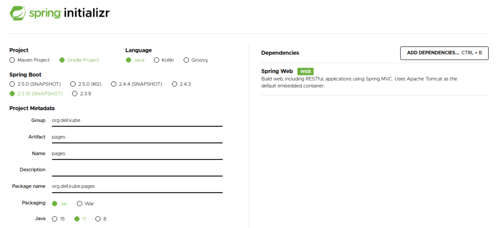

= Building a Spring Boot Application
:stylesheet: boot-flatly.css
:nofooter:
:data-uri:

== Learning Outcomes
After completing the lab, you will be able to:

 . Describe how to develop a simple Spring Boot application
 . Understand how to run the application using build tools
 . Understand how to package the application
 . Describe how to use version control and source code management using Git

== Creating  Spring Boot application

. Create the spring boot application using link:https://start.spring.io[spring initializer, window="_blank"]
 

+
Refer the below example snapshot for creating the application along with its  dependencies - `Spring Web`. You can choose the appropriate version of java and springboot after checking with the instructor.

+

 

+

. Click on `Generate` after adding the dependencies and entering other fields to download the codebase. 

. Extract the codebase to `~/workspace` directory.

. Navigate to `~/workspace/pages` directory in terminal

== Build and Run the application

. Build the application

+
[source,java]
---------------
./gradlew clean build
---------------

. Run the application

+
[source,java]
---------------
./gradlew bootRun
---------------

. Access your application

+
[source,java]
---------------
Browse to http://localhost:8080
---------------

+

You will witness `White Label Error`. This is because, you do not have any endpoints configured which can serve the request. Let us resolve this by adding a `HomeController` class. Stop the running process by entering `CTRL-C` in the terminal. 

. Create the controller

+
[source,java]
---------------
cat > src/main/java/org/dell/kube/pages/HomeController.java << EOF

package org.dell.kube.pages;
import org.springframework.beans.factory.annotation.Value;
import org.springframework.web.bind.annotation.GetMapping;
import org.springframework.web.bind.annotation.RequestMapping;
import org.springframework.web.bind.annotation.RestController;
@RestController
@RequestMapping("/")
public class HomeController {
    @GetMapping
    public String getPage(){
        return "Hello from page : YellowPages";
    }
}

EOF
---------------

. Build the application

+ 
[source,java]
---------------------------------------------------------------------
./gradlew clean build
---------------------------------------------------------------------

. Run the application

+ 
[source,java]
---------------------------------------------------------------------
./gradlew bootRun
---------------------------------------------------------------------

. Access your application

+
[source,java]
---------------------------------------------------------------------
Browse to http://localhost:8080
---------------------------------------------------------------------

== Setting up the codebase

   
. Create a repository called `pages` in your GitHub account. You will need to initialize the local codebase as a git repo & add your remote repository url prior to executing any commits on it

+
[source,java]
---------------------------------------------------------------------
git init
git remote add origin https://github.com/[your-github-user-name]/pages.git
---------------------------------------------------------------------

. Commit code to your github repository

+
[source,java]
---------------------------------------------------------------------
git add .
git config --global user.name "your-team-name"
git config --global user.email "your-git-email-address"
git commit -m "Spring Boot - Lab 1"
git push -u origin master 
---------------------------------------------------------------------
