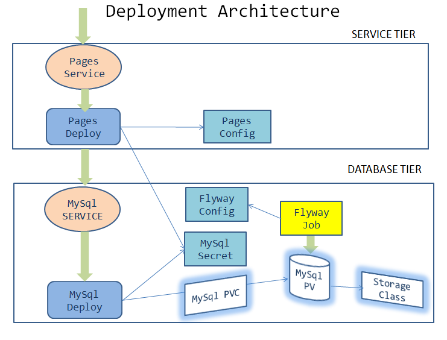

= Designing for deployment - Pages Microservice
:stylesheet: boot-flatly.css
:nofooter:
:data-uri:
:icons: font
:linkattrs:

In this lab we will look into an existing brown field pages microservice and deploy it to the K8s cluster.

== Learning Outcomes
After completing the lab, you will be able to understand

. Deployment Architecture
. Design for deployment
. Deploy 2 tier application

== Develop the pages microservice

.  Docker image of pages microservice is available in the image registry. We will be focusing on designing the deployment architecture.
.  It is necessary to understand the configuration requirements and dependecies, if any, in order for the application to work properly once deployed.
. Let us examine the deployment architecture. The microservice is composed of a 2 tier architecture.
 In order to complete the design:
.. We will have to design the db tier and service tier
.. Look at the dependecies and figure out a way to connect the database tier with the service tier

== Designing the architecture

== Deploying to minikube

.  Create storage related objects in minikube
+
[source,shell script]
--------
kubectl apply -f ~/workspace/kubernetes-manifests/mysql/storage-class.yaml
kubectl apply -f ~/workspace/kubernetes-manifests/mysql/pv.yaml
kubectl apply -f ~/workspace/kubernetes-manifests/mysql/pvc.yaml

--------

+
[source,shell script]
--------
kubectl get storageclasses
kubectl get pv
kubectl get pvc
--------

.  Create configmaps and secrets
+
[source,shell script]
--------
kubectl apply -f ~/workspace/kubernetes-manifests/mysql/configmap.yaml
kubectl apply -f ~/workspace/kubernetes-manifests/mysql/secret.yaml
kubectl apply -f ~/workspace/kubernetes-manifests/pages/config.yaml
--------

.  Create all the services
+
[source,shell script]
--------
kubectl apply -f ~/workspace/kubernetes-manifests/mysql/service.yaml
kubectl apply -f ~/workspace/kubernetes-manifests/pages/service.yaml
--------
.  Create all the deployments and job in minikube
+
[source,shell script]
--------
kubectl apply -f ~/workspace/kubernetes-manifests/mysql/deployment.yaml
kubectl apply -f ~/workspace/kubernetes-manifests/mysql/flyway-job.yaml
kubectl apply -f ~/workspace/kubernetes-manifests/pages/deployment.yaml
--------