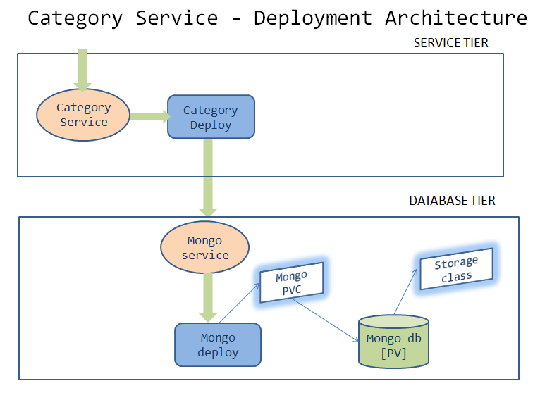

= Designing for deployment - Category microservice
:stylesheet: boot-flatly.css
:nofooter:
:data-uri:

In this lab we will look into an existing brown field category microservice and deploy it to the K8s cluster.

== Learning Outcomes
After completing the lab, you will be able to:

. Deploy category microservice
. Approaching the deployment scenario for a distributed microservice architecture

== Deploying category microservice to K8s
. Download link:https://cloud-native-labs.s3.ap-south-1.amazonaws.com/J21/tailorlabguide/category.zip[category microservice manifest files, window="_blank"] and extract to `~/workspace/kubernetes-manifests/category`
. Download link:https://cloud-native-labs.s3.ap-south-1.amazonaws.com/J21/tailorlabguide/mongo.zip[mongodb manifest files, window="_blank"] and extract to `~/workspace/kubernetes-manifests/mongo`
. Walkthrough the manifest files & understand the solution to the deployment architecture.
. Before we start deploying, replace `[student-name]` with your namespace in all the manifest files.

== Deployment Guide
. Verify the kubectl context `kubectl config get-contexts` is set to minikube. If not, set it to minikube `kubectl config use-context minikube`
. Set up `[student-name]` namespace to point to the current context. If the namespace is not created, the deployments will not work.
+
[source, shell script]
-------------------
kubectl config set-context --current --namespace=[student-name]
-------------------

. Create the Database tier
+
[source, shell script]
-------------------
cd ~/workspace/kubernetes-manifests/mongo
kubectl apply -f storage-class.yaml
kubectl apply -f pv.yaml
kubectl apply -f pvc.yaml
kubectl apply -f service.yaml
kubectl apply -f deployment.yaml
-------------------

. Verify the deployment of database tier

+
[source, shell script]
-------------------
kubectl get deployment mongo
kubectl get service mongo
kubectl get pvc
-------------------

. Proceed further if there are no errors, otherwise troubleshoot and fix them.

. Create the service tier
+
[source, shell script]
-------------------
cd ~/workspace/kubernetes-manifests/category
kubectl apply -f service.yaml
kubectl apply -f deployment.yaml
-------------------

. Verify the deployment of service tier

+
[source, shell script]
-------------------
kubectl get deployment category
kubectl get service category
-------------------

.   Access the category application
+
[source, shell script]
-------------------
kubectl port-forward svc/category 8080:8080
-------------------

+
. Refer <<10-Category-Curl-Commands.adoc#category-curl-section, Curl Guide>> for testing and proceed with the next steps

== Task Accomplished

We successfully deployed a 2 tier category microservice application to K8s cluster.